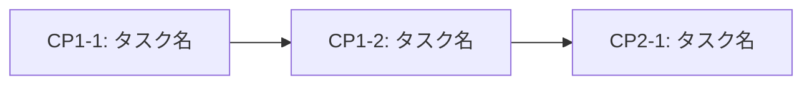

# 引き継ぎ検証ルール

計画書がコンテキストクリア後も作業を引き継げる状態であることを保証するルール。

## 自動検証タイミング

以下のタイミングで引き継ぎ検証を実施：

1. **計画書作成完了時**: フォルダ構成作成後、ユーザー承認前
2. **チェックポイント完了時**: 進捗ファイル更新後
3. **フェーズ完了時**: 次フェーズ開始前

## 検証失敗時の対応

検証に失敗した場合：

1. 不足項目を特定
2. 計画書を自動修正（可能な範囲）
3. 修正内容をユーザーに報告
4. 再検証を実施

## 必須記載事項

### XX_progress.md 必須項目

- [ ] 現在地（Phase X: チェックポイント X-Y）
- [ ] 次のタスク（チェックポイント X-(Y+1): [タスク名]）
- [ ] 詳細ドキュメントへの参照
- [ ] Gitチェックポイント表（コミットハッシュ付き）
- [ ] クリティカルパス状況（該当する場合）
- [ ] 引き継ぎ確認チェックリスト

### 各チェックポイント必須項目

- [ ] タスク一覧（サブタスク含む）
- [ ] 変更対象ファイルのフルパス
- [ ] 実装詳細（コード例または手順）
- [ ] 検証コマンドまたは手順
- [ ] 完了条件
- [ ] 次のチェックポイントへの参照
- [ ] 依存関係（ブロック対象・ブロッカー）

### クリティカルパス必須項目（複数ファイル・フォルダにまたがる場合）

- [ ] 依存関係図（Mermaid または表形式）
- [ ] クリティカルパスの明示（最長経路）
- [ ] ブロッカータスクの⚠️マーク
- [ ] 並列実行可能タスクの明示
- [ ] 対象ファイル/フォルダの明記

## クリティカルパス記述ルール

タスクが複数のファイル・フォルダにまたがる場合、または前後関係（依存関係）がある場合は、overview.mdとXX_progress.mdにクリティカルパスを必ず明記する。

### 記述形式

#### overview.md での記述

```markdown
## クリティカルパス

### 依存関係図



### クリティカルパス特定

**クリティカルパス**: CP1-1 → CP1-2 → CP2-1

| チェックポイント | 依存先 | ブロック対象 | クリティカル | 対象ファイル/フォルダ |
|-----------------|--------|-------------|-------------|---------------------|
| CP1-1 | なし | CP1-2 | ⚠️ Yes | `src/core/` |
```

#### XX_progress.md での記述

```markdown
## クリティカルパス状況

| パス | 状態 | 進捗 |
|------|------|------|
| **クリティカル**: CP1-1 → CP1-2 → CP2-1 | ⏳ | 1/3 完了 |

**現在のボトルネック**: CP1-2
```

## 自己完結性の定義

計画書は以下の条件を満たす場合「自己完結」とみなす：

1. **現在地の明確性**: 進捗ファイルのみで現在のチェックポイントを特定可能
2. **タスクの具体性**: 次に実行すべき作業が具体的に記載
3. **ファイルの特定**: 変更対象ファイルがフルパスで明記
4. **検証の再現性**: 検証コマンド/手順が記載され、誰でも実行可能
5. **依存関係の明示**: 前後関係やブロッカーが明確（該当する場合）

## 検証スキル

`/validate-handoff` スキルで引き継ぎ可能性を検証可能。

詳細: `.claude/skills/validate-handoff/SKILL.md`
