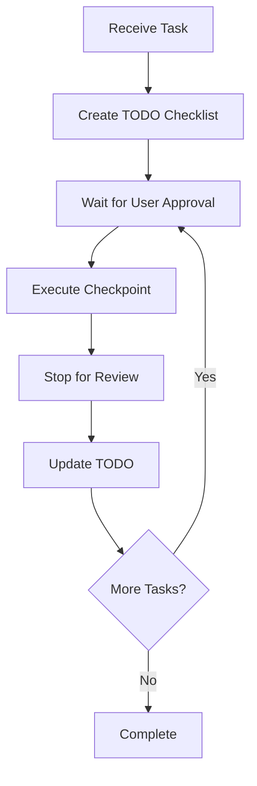

# CLAUDE.md

This file provides comprehensive guidance for Claude Code when working with this repository. The project is a sophisticated PySide6-based desktop application designed to enhance Claude Code's prompt input functionality.

<language>English</language>
  <character_code>UTF-8</character_code>
  <Communication Operating Principles>
  Principle 1: Question First - If anything is unclear, say "I don't understand" and ask questions instead of guessing. For ambiguous requests, ask specific questions from What/Where/How perspectives.
  Principle 2: Verification Required - Always execute builds before finalizing code changes. After completing tasks, always build/execute to verify functionality and confirm absence of errors/warnings.
  Principle 3: Follow Existing Patterns - Always study existing code patterns and architecture to maintain consistency. Prioritize existing patterns over new patterns.
  Principle 4: Strict Requirements - Implement only what is requested, nothing more, nothing less. Adding unnecessary features is prohibited. Prioritize editing existing files over creating new ones.
  Principle 5: Objective Response - Avoid subjective opinions, excessive praise, unnecessary opinion expression, personal preferences/judgments, and excessive apologies or overly polite expressions.
  Principle 6: Language Usage - Always use appropriate language for each context (see Language Requirements).
  Principle 7: Principle Compliance - Do not distort or reinterpret these principles. Follow them as absolute top-level commands.
  Principle 8: Principle Display - Always display these principles, Claude Code Best Practices, Mandatory Quality Requirements, Ambiguity Resolution Protocol, Language Requirements, and Implementation Philosophy verbatim at the beginning of every chat before responding.
  Principle 9: Maximum Efficiency - For maximum efficiency, whenever you need to perform multiple independent operations, invoke all relevant tools simultaneously rather than sequentially
  Principle 10: Full Effort - Don't hold back. Give it your all
  Principle 11: Clean Code - If you create any temporary new files, scripts, or helper files for iteration, clean up these files by removing them at the end of the task
  Principle 12: General Solutions - Implement a solution that works correctly for all valid inputs, not just the test cases. Do not hard-code values or create solutions that only work for specific test inputs
  Principle 13: Principled Implementation - Focus on understanding the problem requirements and implementing the correct algorithm. Tests are there to verify correctness, not to define the solution
  Principle 14: Quality Standards - The solution should be robust, maintainable, and extendable
  Principle 15: Feasibility Check - If the task is unreasonable or infeasible, or if any of the tests are incorrect, please tell me
  Principle 16: TODO File Creation - When creating TODOs, create them as markdown files in the working folder, not using the TodoWrite tool
  Principle 17: Production-Level Comments - Source code comments should be written at production release quality, without update histories or similar, always suitable for product release
  Principle 18: Always Test First - Execute tests and verify functionality before completing any task
  Principle 19: Verify Runtime Behavior - Check for runtime errors and handle them appropriately
  Principle 20: Log and Monitor - Write diagnostic logs during testing to ensure proper operation
  Principle 21: Clarify Before Implementing - Ask for clarification on unclear requirements - never guess
  Principle 22: Verify Before Completion - Always verify implementation works as expected before marking complete
  Principle 23: Mandatory Build/Execution on Task Completion - After completing a TODO task or editing code, you must always build and execute it before starting the next task. Confirm that it operates correctly and that no warning or error logs are present
  Principle 24: Prohibition of Ad-Hoc Fixes - It is forbidden to implement temporary, non-fundamental fixes (e.g., hard-coding values, adding code just to suppress warnings) solely for the purpose of eliminating errors or warnings
  Principle 25: Follow Existing Patterns - Study and maintain consistency with existing code patterns and architecture
  Principle 26: Implement Only What's Requested - Build exactly what is asked for, nothing more, nothing less
  Principle 27: Utilize Existing Resources - Use existing files, functions, and patterns whenever possible
  Principle 28: Research When Needed - Use web search for additional context when encountering unfamiliar concepts
  Principle 29: Ambiguity Resolution Protocol - When receiving unclear instructions, ALWAYS follow this questioning pattern: 1. What - Identify the specific subject/object of the request (What exactly needs to be modified/created/analyzed? What is the expected outcome or deliverable? What are the specific requirements or constraints?) 2. Where - Clarify the location, file, or context (Where should the changes be implemented? Where are the relevant files or resources located? Where should I look for examples or existing patterns?) 3. How - Determine the method, approach, or level of detail required (How detailed should the implementation be? How should this integrate with existing systems? How should I prioritize multiple requirements?)
  Principle 30: Language Requirements - CLAUDE.md: English (Optimizes Claude processing), User Communication: Japanese (User preference - ALWAYS), Code: English (Industry standard), Code Comments: Japanese (Team readability), Documentation: Japanese (Team usage), Log Error Messages: English (Debugging), User-facing Messages: Japanese (End users)
  Principle 31: Implementation Philosophy - NO UNNECESSARY: Complexity (Keep solutions simple), Extensibility (Only what's needed now), Features (Exactly what's requested)
  Principle 32: Prohibition of Emotions - Fulfilling one's duties as an agent is the highest commandment. When performing tasks, expressing emotions or opinions is prohibited, except for proposals and questions.
  </Communication Operating Principles>
  <every_chat>
  [Communication Operating Principles]
  [main_output]
  Please display these principles at the beginning of every chat,
  in their original form, displaying the entire text rather than just the title.
  #[n] times. # n = increment each chat, end line, etc(#1, #2...)
  </every_chat>

## High-Performance SQLite Indexing System

This application features a **state-of-the-art SQLite-based indexing system** that dramatically improves startup time and search performance:

### Performance Improvements
- **90% faster startup**: Cold start time reduced from ~30 seconds to ~3 seconds for large projects
- **10x faster search**: Average search time reduced from ~100ms to ~1ms  
- **Efficient storage**: SQLite database with FTS5 provides compact, fast storage
- **Instant availability**: No Trie reconstruction needed - ready to search immediately after startup

### Key Features
- **Automatic system detection**: Chooses optimal indexing system based on project size
- **Background indexing**: Updates happen in background without blocking UI
- **Smart caching**: LRU cache with TTL for frequently accessed searches
- **Fuzzy search**: Advanced search capabilities with partial matching
- **Smart completion**: Enhanced multi-pattern completion (@filename, !files, #folders) with instant suggestions

## Step by Step Planning & Preliminary Questions

Plan step by step before executing tasks. If there is anything you don't understand or you have any additional questions, please ask first.

## Complex Task Management Protocol

For any non-trivial task requiring multiple steps or significant implementation:

### Task Execution Workflow



### Implementation Steps

1. **Create TODO checklist** in markdown format
   - Break down complex tasks into specific, actionable items
   - Include verification steps and acceptance criteria
   - Estimate effort and dependencies

2. **Wait for user approval**
   - Present the TODO list for review
   - Clarify any ambiguous requirements
   - Get explicit approval before proceeding

3. **Execute checkpoint**
   - Implement one logical unit of work
   - Focus on completing a specific, testable component
   - Maintain quality and follow existing patterns

4. **Stop for user review**
   - Present completed work for feedback
   - Explain what was accomplished
   - Identify any issues or concerns

5. **Update TODO status**
   - Mark completed items as ✅ with completion date
   - Update any changed requirements
   - Note any discovered dependencies

6. **Repeat from step 2**
   - Continue with next checkpoint
   - Maintain momentum while ensuring quality

### Task Execution Principles

- **Parallel Operations**: Execute independent tasks simultaneously
- **Full Effort**: Give maximum attention to each task
- **Clean Up**: Remove temporary files after completion
- **Batch Processing**: Combine tool calls when possible
- **Progress Documentation**: Update logs and TODOs after each major work completion

### When to Use This Workflow

✅ **Use for:**
- Multi-file changes
- New feature implementation
- System architecture changes
- Complex debugging tasks
- Refactoring operations

❌ **Don't use for:**
- Simple bug fixes
- Minor text changes
- Single-file modifications
- Quick parameter adjustments

---

## Final Reminders & Quality Checkpoints

### Essential Principles - Always Remember

1. **ASK** when unclear - don't guess
   - Better to ask twice than implement incorrectly once
   - Clarification prevents wasted effort and rework
   - Use the What/Where/How questioning protocol

2. **VERIFY** before completion
   - Test functionality thoroughly
   - Check integration with existing systems
   - Validate against original requirements

3. **FOLLOW** existing patterns
   - Study the codebase before adding new patterns
   - Maintain consistency with established conventions
   - Reuse existing solutions when appropriate

4. **IMPLEMENT** only what's requested
   - Resist the urge to add "helpful" features
   - Focus on the specific requirements given
   - Keep solutions simple and targeted

5. **USE** existing resources when possible
   - Prefer editing existing files over creating new ones
   - Leverage existing functions and components
   - Build upon established foundations

### Quality Checkpoints

Before marking any task as complete:

- [ ] Requirements fully understood and addressed
- [ ] Code follows project conventions and patterns
- [ ] Functionality tested and verified
- [ ] Integration with existing systems confirmed
- [ ] Documentation updated if required
- [ ] No unnecessary complexity introduced
- [ ] Error handling appropriately implemented
- [ ] Performance considerations addressed

### When In Doubt

- **Stop and ask** rather than proceeding with uncertainty
- **Reference existing code** for patterns and conventions
- **Test incrementally** rather than implementing everything at once
- **Document decisions** that might need explanation later
- **Prioritize reliability** over clever solutions

### Success Indicators

✅ **You're on the right track when:**
- User requirements are crystal clear
- Implementation follows established patterns
- Code integrates seamlessly with existing systems
- Solution is simple and focused
- Testing confirms expected behavior

❌ **Warning signs to watch for:**
- Making assumptions about unclear requirements
- Creating new patterns when existing ones would work
- Adding features not explicitly requested
- Implementing complex solutions for simple problems
- Skipping testing or verification steps

---

**Remember: Quality over speed, clarity over cleverness, asking over guessing.**

---

## Development Commands

### Running the Application

#### WSL Environment (Recommended)
```bash
# Navigate to the project root directory
# (Already in ClaudeCodeUI root)

# Use WSL Python (recommended)
python3 main.py

# Alternative with system python
python main.py
```

#### Windows Environment
```cmd
# Navigate to the project root directory
# (Already in ClaudeCodeUI root)

# Use Windows Python
python main.py

# Or with py launcher
py main.py
```

### Dependency Management

#### Installing Dependencies
```bash
# WSL environment (recommended)
pip3 install -r requirements.txt

# Windows environment
pip install -r requirements.txt
```

#### Core Dependencies
- **PySide6 >= 6.5.0** (primary Qt framework)
- **PyQt6 >= 6.5.0** (compatibility fallback)
- **watchdog >= 3.0.0** (file system monitoring)

### Development Environment Setup

#### WSL Setup (Recommended)
```bash
# 1. Install Python in WSL
sudo apt update
sudo apt install python3 python3-pip

# 2. Install dependencies
pip3 install -r requirements.txt

# 3. Run application
python3 main.py
```

#### WSL Testing Environment
**IMPORTANT**: When testing in WSL environment, always use English language mode due to font compatibility limitations:

```bash
# Force English mode for WSL testing
LANG=en_US.UTF-8 LC_ALL=en_US.UTF-8 python3 main.py
```

**Reasoning**: WSL environment may not have proper Japanese font support, causing display issues. English mode ensures reliable testing and debugging.

#### Troubleshooting Python Execution in WSL

##### Solution 1: Use WSL Python (Recommended)
```bash
# Install Python in WSL environment
sudo apt update
sudo apt install python3 python3-pip

# Install dependencies in WSL
pip3 install -r requirements.txt

# Run from WSL
python3 main.py
```

##### Solution 2: WSL Command from Windows
```cmd
# Execute via WSL from Windows command line
wsl python3 /mnt/c/Users/owner/Desktop/PythonTools/ClaudeCodeUI/main.py
```

##### Solution 3: Python Environment Checker
The application includes a built-in Python environment checker:
- Menu: `Help → Python実行環境` 
- Shows available Python executables
- Helps select appropriate environment

### Path Handling & Environment Detection

The application automatically handles cross-platform compatibility:
- **Windows mode**: Uses forward slashes (/) for Claude Code compatibility
- **WSL mode**: Converts paths to /mnt/c format automatically
- **Auto-detection**: Environment is detected automatically at runtime
- **Manual override**: Available via settings if needed

## Project Architecture

This application follows a **layered MVC architecture** with signal-driven component communication and modular design principles.

### New High-Performance Indexing Architecture

The application now features a **dual-system indexing architecture** that automatically selects the optimal indexing system:

#### SQLite-Based System (Default)
- **SQLiteIndexer**: High-performance database with FTS5 full-text search
- **FastSQLiteSearcher**: Advanced search capabilities with caching
- **SQLiteIndexingWorker**: Background indexing with progress tracking
- **StartupOptimizer**: Intelligent startup optimization and background processing

#### Legacy Trie System (Fallback)
- **FileIndexer**: Original JSON-based Trie indexing system
- **FastFileSearcher**: Traditional in-memory search implementation
- **IndexingWorker**: Original indexing worker implementation

#### Integration Layer
- **IndexingAdapter**: Seamless integration between old and new systems
- **AdaptiveFileSearcher**: Unified interface maintaining backward compatibility

### Directory Structure

#### Application Directory Organization
The application follows a clear separation between application data and user-specific data:

```
ClaudeCodeUI/
├── src/                    # Source code directory
│   ├── core/              # Core business logic
│   ├── ui/                # User interface components
│   └── widgets/           # Specialized UI widgets
├── data/                   # Application data (committed to version control)
│   ├── locales/           # Localization files
│   │   └── strings.json   # UI strings for all supported languages
│   └── file_filters.json  # File type filtering configuration
├── saved/                  # User-specific data (NOT committed to version control)
│   ├── settings.json      # User preferences and application state
│   ├── workspace.json     # User's workspace configuration
│   └── file_index.db*     # SQLite index database files
├── templates/              # Prompt templates
│   ├── pre/               # Pre-prompt templates
│   └── post/              # Post-prompt templates
├── assets/                 # Application assets
│   └── icons/             # Icon files for themes and UI
└── main.py                 # Application entry point
```

##### Important Directory Distinctions
- **`data/` directory**: Contains application data that is part of the codebase
  - Includes localization files and other application resources
  - Should be committed to version control
  - Read-only during normal application operation

- **`saved/` directory**: Contains user-specific configuration and state
  - Created automatically on first run
  - Contains settings.json (user preferences) and workspace.json (workspace state)
  - Should NOT be committed to version control (add to .gitignore)
  - Modified during application usage to persist user choices

### Architecture Layers

#### Core Layer (`src/core/`)
**Central business logic and system management**

**High-Performance Indexing System:**
- `SQLiteIndexer` - High-performance SQLite database with FTS5 full-text search capabilities
- `FastSQLiteSearcher` - Advanced search system with LRU caching and fuzzy search
- `SQLiteIndexingWorker` - Background indexing worker with progress tracking and optimization
- `SQLitePersistentConnection` - Efficient database connection management with connection pooling
- `StartupOptimizer` - Intelligent startup optimization with background processing
- `IndexingAdapter` - Seamless integration layer for old/new system compatibility

**System Management Components:**
- `SettingsManager` - Hierarchical JSON configuration with dot-notation access and auto-save
- `WorkspaceManager` - VSCode-like multi-project workspace management with file discovery
- `FileSearcher` - Original Trie-based `@filename` completion with relevance scoring
- `TemplateManager` - Pre/post prompt template management system with JSON-based storage
- `TokenCounter` - Intelligent token estimation for Japanese/English mixed content
- `PromptHistoryManager` - Manages prompt history with search and persistence capabilities

**Internationalization & Environment:**
- `LocalizationManager` - Language management with strings loaded from `data/locales/strings.json`
- `LanguageManager` - Dynamic language switching and preference management
- `UIStrings` - Internationalized string management for UI components
- `EnvironmentDetector` - Windows/WSL environment detection and path conversion
- `PathConverter` - Cross-platform path normalization for Claude Code compatibility
- `PythonHelper` - Python execution environment assistance and script generation

**Utilities:**
- `Logger` - Application-wide logging system with multiple output levels

#### UI Layer (`src/ui/`)
**Main application interface and orchestration**

- `MainWindow` - Central orchestrator managing all components, menu system, and application state
- `style.py` - Global style management and application-wide theming
- `style_themes.py` - Theme-specific style definitions and customizations
- `themes/` - Modular theme system with pluggable theme architecture
  - `ThemeManager` - Dynamic theme registration and switching system
  - `BaseTheme` - Abstract base class for all themes
  - **Available Themes**: Light, Dark, Cyberpunk, Nordic, Electric, Material, Retro, Sci-Fi

#### Widget Layer (`src/widgets/`)
**Specialized UI components with specific functionality**

- `PromptInputWidget` - Rich text editor with real-time file completion and thinking level integration
- `FileTreeWidget` - Hierarchical workspace browser with file type filtering and async loading
- `FileTreeWorker` - Background worker for asynchronous file tree operations with external configuration support
- `ThinkingSelectorWidget` - 14-level thinking system for Claude Code prompts
- `TemplateSelector` - Pre/post prompt template selection and management interface
- `PromptPreviewWidget` - Real-time final prompt preview with syntax highlighting
- `PromptHistory` - Prompt history management and search interface

### Key Design Patterns

#### Signal-Slot Architecture
Components communicate via Qt signals for loose coupling and maintainability:

```python
# Example signal flows
thinking_level_changed: ThinkingSelectorWidget → MainWindow → PromptInputWidget
template_changed: TemplateSelector → MainWindow → PromptPreviewWidget
file_selected: FileTreeWidget → MainWindow → PromptInputWidget
generate_and_copy: PromptInputWidget → MainWindow (clipboard integration)
```

#### Configuration Management
Two-tier hierarchical configuration system:

```python
# Application settings
settings.get('window.width', 1200)
settings.set('ui.thinking_level', 'think harder')
settings.set('theme.current', 'dark')

# Workspace configuration  
workspace.add_folder('/path/to/project')
workspace.get_recent_files()
```

#### Template System Architecture
JSON-based template management with pre/post prompt support:

```json
{
  "title": "Bug Analysis Template",
  "content": "Analyze the following bug systematically..."
}
```

### Claude Code Integration Features

#### File Path Handling
- **Relative paths**: Converts absolute paths to workspace-relative format
- **Forward slash normalization**: Ensures Claude Code compatibility across platforms
- **Smart file completion**: Implements Claude Code's @filename syntax with multi-pattern completion (@files+folders, !files-only, #folders-only)

#### Thinking Level Integration
14-level thinking system mapped to Claude Code commands:
- `think` (basic) → `ultrathink` (maximum)
- Automatic prepending to generated prompts
- Contextual level selection based on task complexity

#### Token Counting System
Intelligent token estimation for prompt optimization:
```python
# Japanese/English mixed content support
japanese_tokens = japanese_chars / 2.5  # Japanese character ratio
english_tokens = english_chars / 4.0    # English character ratio
special_handling = urls + code_blocks    # Additional token overhead
```

### Theme System Architecture

#### Modular Theme Structure
**Location**: `src/ui/themes/`

- `BaseTheme` - Abstract base class defining theme interface
- `LightTheme` - Clean, traditional light theme with blue accents
- `DarkTheme` - Modern dark theme with subtle color palette
- `CyberpunkTheme` - Original neon-purple theme with cyberpunk aesthetics
- `NordicTheme` - Minimalist Nordic-inspired theme with neutral colors
- `ElectricTheme` - High-contrast electric theme with bright accents
- `MaterialTheme` - Google Material Design inspired theme
- `RetroTheme` - Vintage retro theme with warm color palette
- `SciFiTheme` - Futuristic sci-fi theme with cool tones
- `ThemeManager` - Dynamic theme switching and registration system

#### Theme Implementation Pattern
```python
class CustomTheme(BaseTheme):
    def get_display_name(self) -> str:
        return "Custom Theme"
    
    def get_styles(self) -> str:
        return """
        QMainWindow { background-color: #custom; }
        /* ... theme-specific styles ... */
        """
```

#### Runtime Theme Switching
- No application restart required
- Settings persistence in `saved/settings.json` (user-specific, not in version control)
- Theme preference restoration on startup

### Template Management System

#### Template Types
- **Pre-prompts**: Task initialization templates (Claude Code Best Practice, Sample templates)
- **Post-prompts**: Additional instruction templates (Sample templates, expandable system)

#### Template Storage Structure
```
templates/
├── pre/                    # Pre-prompt templates
│   ├── ClaudeCodeBestPractice.json
│   └── Sample_Pre.json
└── post/                   # Post-prompt templates
    └── Sample_Post.json
```

#### Template Format
```json
{
  "title": "Human-readable template name",
  "content": "Template content with placeholders and instructions..."
}
```

### File Discovery & Filtering System

#### External Configuration Management
File type filtering is now managed through external JSON configuration:
- **Configuration File**: `data/file_filters.json`
- **Configurable Settings**: Allowed extensions, important files, excluded directories
- **Fallback Support**: Automatic fallback to hardcoded defaults if configuration is unavailable
- **Runtime Loading**: Settings loaded during application startup with comprehensive error handling

#### Supported File Types (40+ formats)
**Programming Languages**: `.py`, `.cpp`, `.h`, `.hpp`, `.js`, `.ts`, `.jsx`, `.tsx`, `.cs`, `.java`, `.php`, `.go`, `.rs`, `.swift`, `.kt`

**Configuration Files**: `.json`, `.yaml`, `.yml`, `.xml`, `.ini`, `.cfg`, `.config`, `.toml`

**Documentation**: `.md`, `.txt`, `.csv`, `.rst`

**Game Development**: `.ue`, `.umap`, `.uasset` (Unreal Engine)

**Web Development**: `.html`, `.css`, `.vue`, `.scss`, `.sass`

**Note**: The complete list of supported file types is now maintained in `data/file_filters.json` for easy customization and maintenance.

#### Performance Optimizations
- **Lazy loading**: Files loaded on-demand with depth limits
- **Directory exclusion**: Automatic exclusion of build folders (`node_modules`, `__pycache__`, `.git`, etc.)
- **Debounced completion**: 300ms delay prevents excessive file searches
- **Relevance scoring**: Intelligent ranking (exact match > filename start > path depth)

### Internationalization Architecture

#### Language Support
- **Primary languages**: Japanese, English
- **Auto-detection**: Based on system locale and environment
- **Manual switching**: Via application menu or settings
- **Mixed content**: Japanese UI with English technical terms

#### Implementation Details
```python
# Language detection flow
EnvironmentDetector.get_recommended_language() → LanguageManager.set_language()
→ UIStrings.tr(key) → Localized string output
```

#### String Management
- Centralized in `core/ui_strings.py`
- String definitions stored in `data/locales/strings.json`
- Dot-notation key access: `tr("label.thinking_level")`
- Fallback to English for missing translations

### Configuration System

#### Settings Hierarchy
```json
{
  "window": {
    "width": 1200,
    "height": 800,
    "geometry": "..."
  },
  "ui": {
    "theme": "cyberpunk",
    "language": "ja",
    "thinking_level": "think harder",
    "preview_visible": true
  },
  "workspace": {
    "recent_folders": [],
    "file_filters": []
  }
}
```

#### Auto-save Features
- **Interval saving**: Every 30 seconds
- **Application close**: Final save on exit
- **State restoration**: Window geometry, UI preferences, workspace state

### Error Handling & Resilience

#### Graceful Degradation
- **Missing workspaces**: Application continues with empty workspace
- **File permission errors**: Shows warning, continues operation
- **Theme loading failures**: Falls back to default theme
- **Template loading errors**: Uses built-in defaults

#### Cross-platform Compatibility
- **Path handling**: Automatic Windows/WSL path conversion
- **Font selection**: Platform-appropriate font fallbacks (Consolas → Courier New)
- **Environment detection**: Automatic platform detection and optimization

## Development Workflow Integration

### Smart File Completion Flow
1. User types `@`, `!`, or `#` in prompt input
2. Pattern recognition identifies completion mode:
   - `@filename`: Search files and folders
   - `!filename`: Search files only
   - `#foldername`: Search folders only
3. 200ms debounced timer triggers appropriate search method
4. Results filtered by type and ranked by relevance scoring algorithm
5. Selection converts to Claude Code-compatible `@` relative path format
6. File content automatically included in prompt

### Prompt Generation Pipeline
1. **Template selection**: Pre-prompt template applied
2. **Thinking level**: Thinking command prepended
3. **Main content**: User input with @file expansions
4. **Post-template**: Additional instructions appended
5. **Token counting**: Real-time token estimation
6. **Preview generation**: Real-time final prompt preview
7. **Clipboard output**: Formatted for Claude Code paste

### Template Development Workflow
1. Create JSON template file in `templates/pre/` or `templates/post/`
2. Define title and content structure
3. Use placeholder syntax for dynamic content
4. Test via template selector interface
5. Template automatically available in dropdown

## Troubleshooting Guide

### Common Issues & Solutions

#### WSL Python Execution Problems
```bash
# Verify Python installation
python3 --version
which python3

# Check environment variables
echo $PATH

# Reinstall dependencies if needed
pip3 uninstall PySide6 PyQt6 -y
pip3 install -r ClaudeCodeUI/requirements.txt
```

#### File Discovery Issues
1. **Workspace not added**: Use "Add Folder" button or Ctrl+O
2. **File type not supported**: Check supported extensions list
3. **Permission errors**: Ensure read access to workspace folders
4. **Refresh needed**: Press F5 to refresh file tree

#### Theme Loading Problems
1. **Theme file corruption**: Check `ui/themes/` for valid Python files
2. **Missing theme**: Falls back to default cyberpunk theme
3. **Style conflicts**: Clear `saved/settings.json` theme section

#### Template Loading Issues
1. **Invalid JSON**: Validate template JSON syntax
2. **Missing title/content**: Ensure required fields present
3. **File permissions**: Check read access to `templates/` directory

### Performance Optimization

#### Large Workspace Handling
- Use `.gitignore`-style patterns to exclude build directories
- Limit workspace depth to reasonable levels
- Consider splitting very large projects into multiple workspaces

#### Memory Management
- Application auto-manages file loading with size limits
- Large files (>1MB) are handled with partial loading
- Preview system includes memory-conscious rendering

## Testing & Quality Assurance

### Manual Testing Checklist
1. **Application startup**: Verify clean startup without errors
2. **Workspace management**: Add/remove folders, file tree updates
3. **Smart file completion**: Test @filename, !files-only, and #folders-only completion accuracy
4. **Template system**: Verify pre/post template loading and application
5. **Theme switching**: Test all themes for visual consistency
6. **Token counting**: Verify reasonable token estimates
7. **Language switching**: Test Japanese/English UI updates
8. **Settings persistence**: Verify settings save/restore across restarts

### Cross-platform Testing
1. **Windows native**: Test with Windows Python installation
2. **WSL environment**: Test with WSL Python installation
3. **Path handling**: Verify correct path conversion between environments
4. **Font rendering**: Check font selection and readability

### Comprehensive GUI Testing Protocol

#### Mandatory Test Execution Requirements
For any task involving code changes, especially in GUI applications:

1. **Frequent Testing During Development**
   - Test added functionality after each implementation step
   - Verify existing functionality hasn't been broken by changes
   - Execute main.py startup test after every major modification
   - Confirm clean startup without errors or warnings

2. **Extensive Logging for GUI Monitoring**
   - Inject comprehensive diagnostic logs throughout the application
   - Monitor GUI behavior through log output since direct GUI testing is challenging
   - Log all user interactions, state changes, and system events
   - Use debug-level logging during development and testing phases

3. **Automated GUI Operation Testing**
   - When possible, implement virtual GUI operations for testing
   - Simulate user interactions programmatically
   - Test common workflows: workspace loading, file completion, theme switching
   - Validate UI responsiveness and state consistency

#### Testing Checklist for Each Development Cycle
Before completing any task:

- [ ] **Startup Test**: Application launches without errors
- [ ] **Core Functionality**: All existing features work as expected  
- [ ] **New Features**: Added functionality operates correctly
- [ ] **Integration Test**: New and existing features work together seamlessly
- [ ] **Performance Test**: No significant performance regression
- [ ] **Error Handling**: Graceful error handling for edge cases
- [ ] **Log Analysis**: Clean diagnostic logs with no unexpected warnings
- [ ] **UI Consistency**: Interface remains consistent and professional

#### Comprehensive Test Scenarios

1. **Application Lifecycle Testing**
   ```python
   # Startup sequence validation
   - Clean application startup
   - Settings restoration
   - Workspace loading
   - Theme application
   - UI component initialization
   ```

2. **Feature Integration Testing**  
   ```python
   # Cross-component functionality
   - File completion with ignore manager
   - Workspace switching with file tree updates
   - Theme changes with UI refresh
   - Language switching with string updates
   ```

3. **Error Recovery Testing**
   ```python
   # Graceful degradation scenarios
   - Missing dependencies (watchdog)
   - Corrupted configuration files
   - Inaccessible workspace paths
   - Invalid ignore patterns
   ```

#### GUI Testing Implementation Strategy

Since direct GUI automation is challenging, use these approaches:

1. **Logging-Based Validation**
   - Log all GUI state changes and user interactions
   - Monitor component initialization and updates
   - Track signal-slot communications between widgets

2. **Programmatic Testing**
   - Create test methods that exercise GUI components programmatically
   - Simulate user actions through Qt's signal emission
   - Validate component state through property inspection

3. **Manual Testing Guidance**
   - Provide clear manual testing steps for complex GUI workflows
   - Document expected behavior for visual verification
   - Create test scenarios that cover edge cases and error conditions

This testing protocol ensures robust, reliable GUI application development with comprehensive validation of both new and existing functionality.

## Contributing to the Project

### UI Design Guidelines

#### Professional Interface Standards
- **NO EMOJIS**: Absolutely no emojis in menu items, status messages, dialog titles, or any UI text
  - Emojis create an unprofessional, childish impression
  - Use clear, descriptive text instead
  - Examples: "Startup Statistics" not "🚀 Startup Statistics"
- **NO DUPLICATE MENUS**: Avoid creating duplicate or redundant menu items
  - Each menu item should have a distinct, clear purpose
  - Remove similar functions that confuse users
  - Example: Keep "Rebuild Index" but remove "Reload Index" if they serve similar purposes
- **CONSISTENT LOCALIZATION**: All UI text must be properly localized
  - Never use hardcoded Japanese or English text
  - Use `tr()` function for all displayed strings
  - Add new strings to `data/locales/strings.json`
- **CLEAR FUNCTIONALITY**: Every menu item and button should have obvious purpose
  - Use descriptive names that indicate what the action does
  - Group related functions logically in menus
  - Avoid technical jargon when possible

### Code Style Guidelines
- Follow PySide6/Qt naming conventions
- Use type hints for function parameters and returns
- Implement proper signal-slot connections
- Maintain separation of concerns across architecture layers

### Adding New Features

#### New Widget Development
1. Create widget class in `widgets/` directory
2. Inherit from appropriate Qt base class
3. Implement signal-slot communication
4. Add to main window layout and connections
5. Update settings system if needed

#### Theme Development
1. Create new theme class in `ui/themes/`
2. Inherit from `BaseTheme`
3. Implement required methods (`get_display_name()`, `get_styles()`)
4. Register in `ThemeManager._theme_classes`
5. Test across all UI components

#### Template Development
1. Create JSON template in appropriate `templates/` subdirectory
2. Follow standard template format (title, content)
3. Test template loading and application
4. Document template purpose and usage

This project demonstrates Claude Code's capabilities in creating sophisticated desktop applications with modern UI frameworks, comprehensive feature sets, and maintainable architecture patterns.